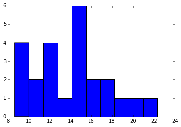
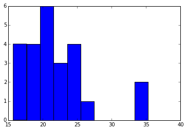

1) What is our independent variable? What is our dependent variable?

The independent variable is the whether the words are congruent versus incongruent. The dependent variable is the time it takes for participants to name the ink color in equally-sized lists.

2) What is an appropriate set of hypotheses for this task? What kind of statistical test do you expect to perform? Justify your choices.

Null Hypothesis: Time it takes participants to name the ink color in equally-sized lists of congruent and incongruent text is not significantly different.

Alternative Hypothesis: Time it takes participants to name the ink color in equally-sized lists of congruent and incongruent text is significantly different.

I intend to use reapted measure design test (a type of dependent sample design), because we are testing each subject for two separate test conditions.

3) Report some descriptive statistics regarding this dataset. Include at least one measure of central tendency and at least one measure of variability.


```python
import pandas as pd
```


```python
path = r'~/Desktop/Data Science/Udacity Nanodegree/Project 1/stroopdata.csv'

dataFrame = pd.read_csv(path)
dataFrame
```


<div>
<table border="1" class="dataframe">
  <thead>
    <tr style="text-align: right;">
      <th></th>
      <th>Congruent</th>
      <th>Incongruent</th>
    </tr>
  </thead>
  <tbody>
    <tr>
      <th>0</th>
      <td>12.079</td>
      <td>19.278</td>
    </tr>
    <tr>
      <th>1</th>
      <td>16.791</td>
      <td>18.741</td>
    </tr>
    <tr>
      <th>2</th>
      <td>9.564</td>
      <td>21.214</td>
    </tr>
    <tr>
      <th>3</th>
      <td>8.630</td>
      <td>15.687</td>
    </tr>
    <tr>
      <th>4</th>
      <td>14.669</td>
      <td>22.803</td>
    </tr>
    <tr>
      <th>5</th>
      <td>12.238</td>
      <td>20.878</td>
    </tr>
    <tr>
      <th>6</th>
      <td>14.692</td>
      <td>24.572</td>
    </tr>
    <tr>
      <th>7</th>
      <td>8.987</td>
      <td>17.394</td>
    </tr>
    <tr>
      <th>8</th>
      <td>9.401</td>
      <td>20.762</td>
    </tr>
    <tr>
      <th>9</th>
      <td>14.480</td>
      <td>26.282</td>
    </tr>
    <tr>
      <th>10</th>
      <td>22.328</td>
      <td>24.524</td>
    </tr>
    <tr>
      <th>11</th>
      <td>15.298</td>
      <td>18.644</td>
    </tr>
    <tr>
      <th>12</th>
      <td>15.073</td>
      <td>17.510</td>
    </tr>
    <tr>
      <th>13</th>
      <td>16.929</td>
      <td>20.330</td>
    </tr>
    <tr>
      <th>14</th>
      <td>18.200</td>
      <td>35.255</td>
    </tr>
    <tr>
      <th>15</th>
      <td>12.130</td>
      <td>22.158</td>
    </tr>
    <tr>
      <th>16</th>
      <td>18.495</td>
      <td>25.139</td>
    </tr>
    <tr>
      <th>17</th>
      <td>10.639</td>
      <td>20.429</td>
    </tr>
    <tr>
      <th>18</th>
      <td>11.344</td>
      <td>17.425</td>
    </tr>
    <tr>
      <th>19</th>
      <td>12.369</td>
      <td>34.288</td>
    </tr>
    <tr>
      <th>20</th>
      <td>12.944</td>
      <td>23.894</td>
    </tr>
    <tr>
      <th>21</th>
      <td>14.233</td>
      <td>17.960</td>
    </tr>
    <tr>
      <th>22</th>
      <td>19.710</td>
      <td>22.058</td>
    </tr>
    <tr>
      <th>23</th>
      <td>16.004</td>
      <td>21.157</td>
    </tr>
  </tbody>
</table>
</div>


```python
dataFrame['Congruent'].describe()
```


    count    24.000000
    mean     14.051125
    std       3.559358
    min       8.630000
    25%      11.895250
    50%      14.356500
    75%      16.200750
    max      22.328000
    Name: Congruent, dtype: float64


```python
dataFrame['Incongruent'].describe()
```


    count    24.000000
    mean     22.015917
    std       4.797057
    min      15.687000
    25%      18.716750
    50%      21.017500
    75%      24.051500
    max      35.255000
    Name: Incongruent, dtype: float64


4) Provide one or two visualizations that show the distribution of the sample data. Write one or two sentences noting what you observe about the plot or plots.


```python
%pylab inline

plt.hist(dataFrame['Congruent'])

plt.show()
```

    Populating the interactive namespace from numpy and matplotlib





For the congruent data set, the range goes from 8.6 to 22.3, with the highest concentration between 14-16.


```python
%pylab inline

plt.hist(dataFrame['Incongruent'])

plt.show()
```

    Populating the interactive namespace from numpy and matplotlib





For the incongruent data set, the range goes from 15.7 to 35.3, with the highest concentration between 20-22. 

5) Now, perform the statistical test and report your results. What is your confidence level and your critical statistic value? Do you reject the null hypothesis or fail to reject it? Come to a conclusion in terms of the experiment task. Did the results match up with your expectations?

degrees of freedom = 23 (n = 24)
t-statistic = -8.02
p-value = less than 0.0001

We can reject the null hypothesis with an over 99.99% confidence level, and conclude that there is a significant difference in the time it takes participants to read congruent text vs. incongruent text. This is what I had expected, because it aligned with the results of my personal experience.

6) Optional: What do you think is responsible for the effects observed? Can you think of an alternative or similar task that would result in a similar effect? Some research about the problem will be helpful for thinking about these two questions!

There are 4 theories as to the cause of the Stroop effect. 1) Processing speed: the brain reads the word faster than its ability to recognize the color. 2) Selective attention: more attention is necessary for recognizing color. 3) Automaticity (most common theory): brain automatically understands the meaning of words, but does not automatically process color. 4) Parallel distributed processing: automaticity is a function of the strength of each pathway, hence, when two pathways are activated simultaneously in the Stroop effect, interference occurs between the stronger (word reading) path and the weaker (color naming) path, more specifically when the pathway that leads to the response is the weaker pathway.

A proposed similar task that would yield similiar effects is listing different numerical digits (e.g. 4, 5) but in different font sizes. So, an incongruent example of this would be to have 4 in a much larger font than 5. Similar effects from this test has been documented.

Additional Information Used:

http://www.statsblogs.com/2014/03/12/python-numerical-descriptions-of-the-data/

https://en.wikipedia.org/wiki/Stroop_effect
